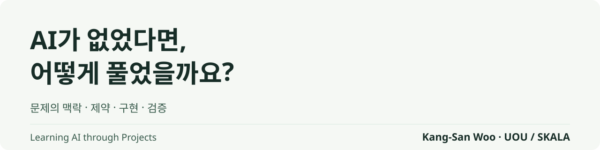
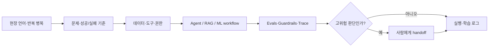

<picture>
  <source media="(prefers-color-scheme: dark)" srcset="./assets/profile-banner-dark.svg">
  <source media="(prefers-color-scheme: light)" srcset="./assets/profile-banner-light.svg">
  
</picture>

# 우강산 · Woogangsan

**AI Product Engineer · Forward Deployed Engineer**<br>
AI를 쓰는 데서 멈추지 않고, **AI가 책임 있게 일할 구조**를 설계합니다.

문제를 탐색·분석·생성·검증 단위로 나누고, 데이터와 도구를 연결하며, 평가셋·실패 기준·사람 승인으로 실행 경계를 만듭니다. 모델 점수보다 **실제 업무 기준을 통과했는지**를 먼저 봅니다.

```text
현장 병목 → 데이터·도구 경계 → AI workflow → eval·중단 조건 → 사람의 판단과 승인
```

## 30초 포트폴리오

| 프로젝트 | 문제를 좁힌 방식 | 검증 가능한 증거 | 내린 결정 |
| --- | --- | --- | --- |
| **[산업 검사 데이터 감사](https://github.com/woorivermountain/inspection-data-audit)** | 높은 정확도보다 누설·표본 독립성·시간 강건성을 먼저 감사 | Siemens SMT AOI **440,274행**, 미래 AUROC **0.878** | 결함 누락 1% 이하에서 검사량 절감 **3.16%**로 목표 40% 미달 → **적용 보류** |
| **[골든타임](https://github.com/woorivermountain/goldentime)** | 자동판정을 근거 검색형 조사 보조로 전환 | 판정례 **56,535건**, 분류 **1,253건 Top-3 79%**, 검색 **140건 Hit@10 78% · MRR 0.52** | AI는 근거를 찾고 최종 판단은 조사자에게 유지 |
| **[Meeting Copilot](https://github.com/woorivermountain/meeting-copilot)** | 상시 녹음·자동 저장 대신 명시적 호출과 승인 흐름 설계 | 근거성 **100%**, 명단 밖 담당자 **0건**, 일반 발화 호출 **0건** | 검증·승인된 결정과 할 일만 저장 |
| **[ESS 배터리 수명 예측](https://github.com/woorivermountain/ess-battery-life)** | 무작위 분할 대신 Batch 1 개발·Batch 2 고정 평가 | Batch 1 CV MAPE **7.49%**, Batch 2 MAPE **26.59%** | 더 좋아 보인 사후 모델로 바꾸지 않고 분포 이동과 실패를 보고 |

## 제가 맡는 연결부



- **Product** — 사용자 인터뷰와 업무 흐름을 기능·데이터 계약·출시 기준으로 번역합니다.
- **Engineering** — Python·TypeScript로 RAG, Agent workflow, API와 검증 코드를 직접 구현합니다.
- **Evaluation** — 평균 점수만 보지 않고 누설, 분포 이동, 근거성, 비용과 업무 KPI를 함께 봅니다.
- **Responsibility** — AI의 권한, 저장 범위, 중단 조건과 사람의 최종 책임을 제품 안에 넣습니다.

## 프로젝트를 읽는 두 가지 경로

**AI Product / PO 관점**<br>
[골든타임](https://github.com/woorivermountain/goldentime) → [Meeting Copilot](https://github.com/woorivermountain/meeting-copilot) → [스마트 안전모 관제 시뮬레이터](https://github.com/woorivermountain/smart-safety-helmet)

**FDE / Applied AI 관점**<br>
[산업 검사 데이터 감사](https://github.com/woorivermountain/inspection-data-audit) → [Meeting Copilot](https://github.com/woorivermountain/meeting-copilot) → [ESS 배터리 수명 예측](https://github.com/woorivermountain/ess-battery-life)

## 현재

SKALA 4기에서 LLM·RAG·Agent·MLOps를 학습하며, 데모가 아니라 반복할수록 신뢰가 쌓이는 AI 업무 시스템을 만들고 있습니다.

> 이 GitHub는 결과만 전시하지 않습니다. 재현 절차, 실패한 가설, 적용하지 않은 이유와 아직 검증하지 못한 범위까지 남깁니다.
