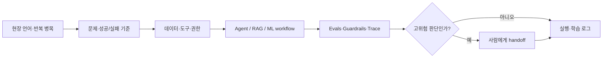

<picture>
  <source media="(prefers-color-scheme: dark)" srcset="./assets/profile-banner-dark.svg">
  <source media="(prefers-color-scheme: light)" srcset="./assets/profile-banner-light.svg">
  
</picture>

# 우강산 · Kangsan Woo

**AI Product Engineer · Forward Deployed Engineer**<br>
AI를 쓰는 데서 멈추지 않고, **AI가 책임 있게 일할 구조**를 설계합니다.

저는 성능 좋은 데모를 하나 더 만드는 것보다, AI가 현장에서 반복해서 일할 수 있는 구조를 만드는 데 더 관심이 많습니다. 문제를 작게 나누고 AI에 맡길 일과 사람이 끝까지 책임질 일을 구분합니다. 수치가 좋아도 데이터가 의심스럽거나 실제 업무 목표에 못 미치면, 억지로 적용하지 않습니다.

```text
현장 병목 → 데이터·도구 경계 → AI workflow → eval·중단 조건 → 사람의 판단과 승인
```

## 30초 포트폴리오

| 프로젝트 | 시작한 질문 | 직접 확인한 것 | 그래서 내린 결정 |
| --- | --- | --- | --- |
| **[산업 검사 데이터 감사](https://github.com/woorivermountain/inspection-data-audit)** | 높은 정확도보다 누설·표본 독립성·시간 강건성을 먼저 감사 | Siemens SMT AOI **440,274행**, 미래 AUROC **0.878** | 결함 누락 1% 이하에서 검사량 절감 <strong>3.16%</strong>로 목표 40% 미달 → **적용 보류** |
| **[골든타임](https://github.com/woorivermountain/goldentime)** | 자동판정을 근거 검색형 조사 보조로 전환 | 판정례 **56,535건**, 분류 **1,253건 Top-3 79%**, 검색 **140건 Hit@10 78% · MRR 0.52** | AI는 근거를 찾고 최종 판단은 조사자에게 유지 |
| **[Meeting Copilot](https://github.com/woorivermountain/meeting-copilot)** | 상시 녹음·자동 저장 대신 명시적 호출과 승인 흐름 설계 | 근거성 **100%**, 명단 밖 담당자 **0건**, 일반 발화 호출 **0건** | 검증·승인된 결정과 할 일만 저장 |
| **[ESS 배터리 수명 예측](https://github.com/woorivermountain/ess-battery-life)** | 무작위 분할 대신 Batch 1 개발·Batch 2 고정 평가 | Batch 1 CV MAPE **7.49%**, Batch 2 MAPE **26.59%** | 더 좋아 보인 사후 모델로 바꾸지 않고 분포 이동과 실패를 보고 |

## 제가 주로 하는 일



- 현업의 이야기를 듣고, “결국 어디에서 시간이 새고 있는가”를 기능과 데이터 기준으로 바꿉니다.
- 기획에서 멈추지 않고 Python·TypeScript로 RAG, Agent workflow, API와 평가 코드를 직접 만듭니다.
- 평균 점수 하나로 결론내리지 않습니다. 누설, 분포 이동, 비용과 실제 업무 효과를 함께 확인합니다.
- AI가 틀렸을 때 누가 알아차리고 멈출지, 무엇을 저장하고 무엇은 사람에게 돌려줄지까지 설계합니다.

## 어디서부터 보면 좋을까요?

**AI Product / PO 관점**<br>
[골든타임](https://github.com/woorivermountain/goldentime) → [Meeting Copilot](https://github.com/woorivermountain/meeting-copilot) → [스마트 안전모 관제 시뮬레이터](https://github.com/woorivermountain/smart-safety-helmet)

**FDE / Applied AI 관점**<br>
[산업 검사 데이터 감사](https://github.com/woorivermountain/inspection-data-audit) → [Meeting Copilot](https://github.com/woorivermountain/meeting-copilot) → [ESS 배터리 수명 예측](https://github.com/woorivermountain/ess-battery-life)

## 현재

지금은 SKALA 4기에서 LLM·RAG·Agent·MLOps를 배우고 있습니다. 배운 기술을 나열하기보다, 작은 프로젝트라도 왜 만들었고 어디서 실패했는지 설명할 수 있게 남기려 합니다.

> 잘된 결과만 골라 올리지는 않습니다. 다시 실행하는 방법, 실패한 가설, 적용하지 않은 이유와 아직 모르는 부분도 함께 남깁니다.
