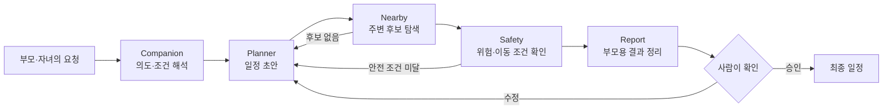

# 무박 2일, 5개 Agent를 하나의 흐름으로 묶은 기록

제11회 부울경 AI융합 해커톤에서 4인 팀의 팀장·솔루션 설계·PO를 맡았습니다. 시니어 자녀 동행 AI ‘동행’을 만들었고, 일반부 우수상인 부산정보산업진흥원장상을 받았습니다.

수상보다 더 오래 남은 건 마지막 밤의 일이었습니다. 팀원마다 맡은 기능은 돌아가는데, 한 사람이 서비스를 처음부터 끝까지 쓰면 중간중간 흐름이 끊겼습니다. 저는 새로운 기능을 더 만드는 대신, 이미 만든 것들이 같은 입력과 상태를 주고받도록 연결하는 일을 맡았습니다.

> 이 문서는 공개 가능한 설계와 제 역할을 정리한 case study입니다. 팀 저장소와 API 설정은 공개하지 않았으며, 운영 서비스나 실제 사용자 효과를 주장하지 않습니다.

## 만들었던 흐름

Companion은 자연어 요청에서 지역·시간·취향과 이동 조건을 읽었습니다. Planner는 일정의 뼈대를 만들고, Nearby와 Safety가 장소 후보와 위험 조건을 확인했습니다. Report는 자녀가 볼 계획과 부모가 확인할 정보를 나눠 보여줬습니다.

## 제가 맡은 일

| 팀에서 막힌 지점 | 제가 한 일 | 확인 기준 |
| --- | --- | --- |
| Agent마다 입력 이름과 형식이 달랐음 | 공통 필드와 Agent별 입력·출력을 표로 맞춤 | 앞 단계 결과가 수작업 변환 없이 다음 단계로 넘어가는가 |
| 장소 후보가 비거나 API가 실패하면 전체 흐름이 멈춤 | 빈 데이터·잘못된 출력·API 실패를 먼저 분기 | 실패해도 사용자가 이전 단계로 돌아가 다시 선택할 수 있는가 |
| 부모 화면과 자녀 화면의 정보가 어긋남 | 같은 계획 ID와 상태를 기준으로 handoff 정의 | 한쪽의 수정이 다른 화면에 모순 없이 반영되는가 |
| 네 사람이 만든 구현의 우선순위가 달랐음 | 심사 시연의 한 사용자 여정을 기준으로 연결 순서 결정 | 처음 요청부터 최종 확인까지 끊기지 않고 시연되는가 |

코드를 가장 많이 쓰는 사람이 되기보다, 각자의 구현이 실제 사용자 흐름에서 만나는 지점을 찾으려 했습니다. 문제가 생기면 “누구 코드가 틀렸는가”보다 “어느 경계의 계약이 비어 있는가”를 먼저 봤습니다.

## 실패를 다룬 순서

1. 정상 응답보다 빈 배열·필수 필드 누락·타입 오류를 먼저 넣어봤습니다.
2. 한 Agent가 실패해도 전체 화면이 멈추지 않도록 이전 선택과 재계획 경로를 남겼습니다.
3. API 응답이 늦거나 없을 때 보여줄 상태를 팀원과 맞췄습니다.
4. 마지막에는 기능 수를 늘리지 않고 부모–자녀 화면 사이의 연결을 반복해서 확인했습니다.

## 이 경험이 이후 프로젝트에 남긴 것

이때는 빠르게 연결하는 데 집중하느라 평가셋과 trace를 충분히 남기지 못했습니다. 그 아쉬움 때문에 이후 [Meeting Copilot](https://github.com/woorivermountain/meeting-copilot)에서는 Agent 출력 계약, 실패 시 빈 결과, 평가셋과 사람 승인 단계를 코드로 만들었습니다.

해커톤에서 배운 건 “Agent를 여러 개 쓰면 좋은 시스템이 된다”는 것이 아니었습니다. 역할이 많아질수록 입력·권한·실패·handoff를 더 명확하게 정해야 한 사람이 끝까지 사용할 수 있다는 점이었습니다.

## 지금 말할 수 있는 범위

- 4인 팀에서 팀장·솔루션 설계·PO 역할을 맡았습니다.
- GPT-4o-mini 기반 5개 Agent와 부모·자녀 화면의 연결 기준을 정리했습니다.
- 무박 2일 동안 통합과 예외 흐름을 조정했고 일반부 우수상을 받았습니다.
- 실제 사용자 파일럿, 장기 운영 안정성, 비용·지연 평가는 수행하지 않았습니다.
